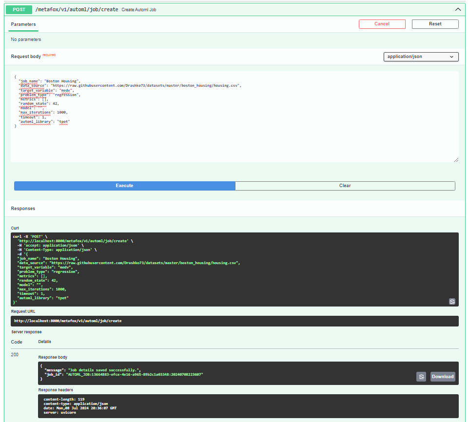
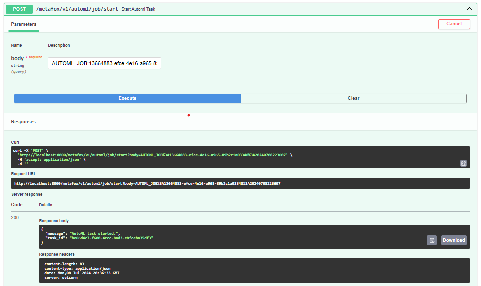
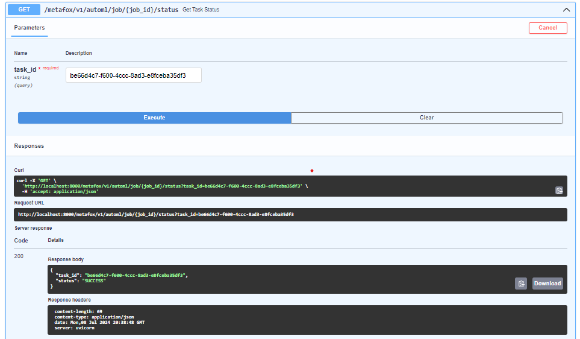
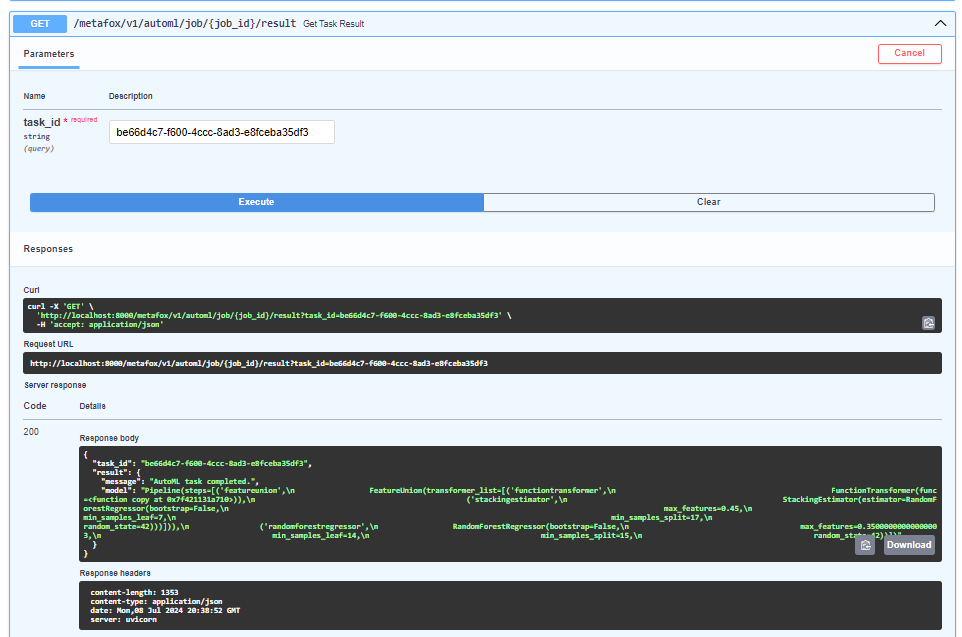

## MetaFOX Examples

This directory contains various examples showcasing the features of the project.

### Creating an AutoML job

Description: This example demonstrates the process of creating an AutoML job that is being stored inside of a Redis database in a form of **key:value** where key is an automatically generated id and value consists of parameters passed by the user regarding an AutoML job.

Request body:
```bash
{
  "job_name": "Boston Housing",
  "data_source": "https://raw.githubusercontent.com/Drashko73/datasets/master/boston_housing/housing.csv",
  "target_variable": "medv",
  "problem_type": "regression",
  "metrics": [],
  "random_state": 42,
  "model": "",
  "max_iterations": 1000,
  "timeout": 1,
  "automl_library": "tpot"
}
```
Example request and response:


### Starting an AutoML job

Description: After successfully storing the job details, based on the generated id, user can start submitted job.

Request body:
```bash
# This request body is likely going to be different, please use the id returned as a response of a previous action.
AUTOML_JOB:13664883-efce-4e16-a965-89b2c1a03348:20240708223607
```
Example request and response:


### Checking job status

Description: Based on a provided task id, user can check status of a job.

Request body:
```bash
# This request body is likely going to be different, please use the task id returned as a response of a previous action.
be66d4c7-f600-4ccc-8ad3-e8fceba35df3
```
Example request and response:


### Getting the result

Description: After successfully completing the job, user is able to retrieve the optimized model based on the id of a task as well;

Request body:
```bash
# This request body is likely going to be different, please use the task id returned as a response of a previous action.
be66d4c7-f600-4ccc-8ad3-e8fceba35df3
```
Example request and response:
